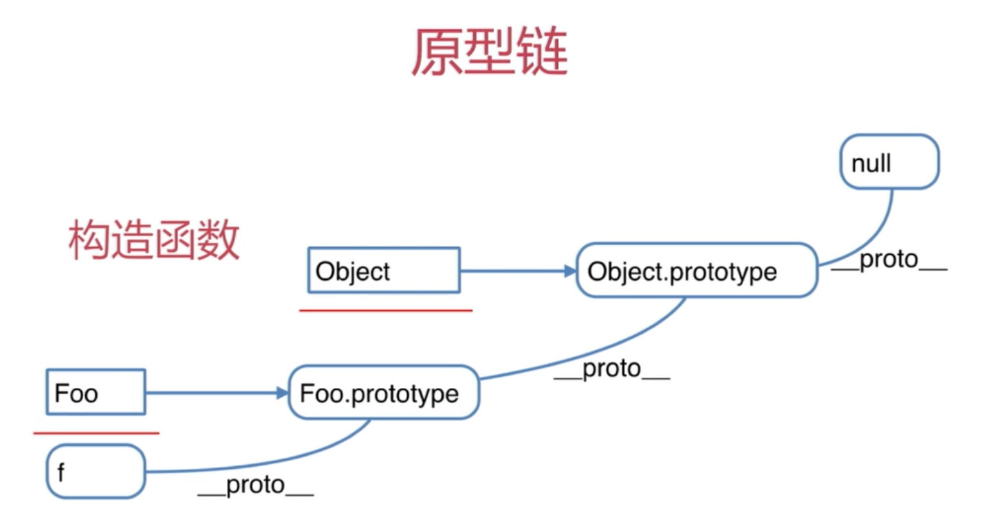

# JS 基础
1.	工程师的自我修养-基础
2. 扎实的基础会让你高效学习新技术

##	面试题
1.	JS中使用typeof能得到哪些类型	=> JS变量类型
2. 何时使用===和==		=>强制类型转换
3. window.onload和DOMContentLoaded的区别  => 浏览器渲染过程
4. 用JS创建10个a标签,点击的时候弹出来对应的序号 => 作用域
5. 简述如何实现一个模块加载器,实现类似require.js的基本功能  => JS模块化
6. 实现数组的随机排序  =>  JS基础算法

##	思考
1.	拿到一个面试题,你第一时间看到的是什么	==> 考点,到底想考我什么
2. 又如何看待网上搜出来的永远看不完的题海	==>	不变应万变,题目是变得,知识不变
3. 如何对待接下来遇到的面试题	==>	题目到知识再到题目


#	变量类型和计算
## 题目
1.	JS中使用typeof能得到的哪些类型
2. 何时使用=== 和 ==
3. JS中有哪些内置函数
4. JS变量按照存储方式区分为哪些类型,并描述其特点
5. 如何理解JSON

##	变量类型
###值类型 vs 引用类型
1.	值类型: 为基本类型
2. 引用类型: 变量保存的是指针,(对象,数组,函数)

### typeof 只能确定值类型的具体类型
1.	undefined
2. string
3. boolean
4. object
5. function
6. number

###	变量计算- 强制类型转换
1.	字符串拼接
	1.	var n = 100 +  '10' => 10010
2. == 运算符(慎用)
	1.	100 == '100' => true
	2. 0 == '' => true
	3. null == undefined => true
3. if语句
	1.	if会把条件强制转换成boolean
4. 逻辑运算
	1.	10 && 0  // true && 0  //0
	2. '' || 'abc' // abc
	3. !window.adc // true

### 判断一个变量的boolean
1.	var a = 100
2. console.log(!!a)

### 何时使用 === 和 ==
1.	只有判断一个值是否为 null 或 undefined 的时候才可用 ==  (jquery源码推荐)
2. obj.a == null  => obj.a === null || obj.a === undefined

### JS中有哪些内置函数
1.	Object
2. Array
3. Boolean
4. Number
5. String
6. Function
7. Date
8. RegExp
9. Error

### JS变量按照存储方式区分为哪些类型,并描述其特点
1.	值类型
2. 引用类型

### 如何理解JSON
1.	JSON是一个JS对象
2. JSON.stringify({a:10,b:20})	// 对象变字符串
3. JSON.parse('{"a" : 10, "b" : 20}')	//字符串变对象

# 原型 和 原型链
##	题目
1.	如何准确判断一个变量是数组类型
2.	写一个原型链继承的例子
3. 描述new 一个对象的过程
4. zepto 源码中如何实用原型链

## 构造函数
```js
function Foo(name,age) {
  this.name = name
  this.age = age
  this.class = 'class-1'
  //return this  默认是有这一行 => this是实例
}

var f = new Foo('zhangsan', 20)
```

## 构造函数-扩展
1.	var a = {} 其实就是var a = new Object() 的语法糖
2. var a = [] 其实就是var a = new Array()的语法糖
3. function Foo(){} 其实就是var Foo = new Function()的语法糖
4. 实用instanceof判断一个函数是否是一个变量的构造函数

##	原型规则和示例
###	所有的引用类型(数组,对象,函数), 都具有对象特性,即可自由扩展属性(除了null)
```js
{
  var obj = {}
  obj.a = 100
  var arr = []
  arr.a = 100
  function fn (){}
  fn.a=100
}
```

### 所有的引用类型(数组,对象,函数), 都有一个__proto __属性,属性值是一个普通的对象
```js
{
  console.log(obj.__proto__)
  console.log(arr.__proto__)
  console.log(fn.__proto__)
}
```

### 所有的函数,都有一个prototype属性,属性值也是一个普通的对象
```js
  console.log(fn.prototype)
```

###	所有的引用类型(数组,对象,函数), __proto__属性值指向他的构造函数的 prototype 属性值
```js
console.log(obj.__proto__ === Object.prototype)
```

###	当试图得到一个对象的某个属性时,如果这个对象本身没有这个属性,那么会去他的__proto __(即他的构造函数的prototype)中寻找
```js
{
  //构造函数
  function Foo(name,age) {
    this.name = name
  }
  Foo.prototype.alertName = function() {
    alert(this.name)
  }
  //创建示例
  var f = new Foo('zhangsan')
  f.printName = function(){
    console.log(this.name)
  }

  f.printName()
  f.alertName()
}
```

## 循环对象自身的属性
```js
{
  var item
  //  高级浏览器已经在for in 中屏蔽了来自原型的属性
  //  但是这里建议大家还是加上这个判断,保证程序的健壮性
  for ( item in f) {
    if (f.hasOwnProperty(item)) {
      console.log(item)
    }
  }
}
```

## 原型链
```js
{
  //构造函数
  function Foo(name,age) {
    this.name = name
  }
  Foo.prototype.alertName = function() {
    alert(this.name)
  }
  //创建示例
  var f = new Foo('zhangsan')
  f.printName = function(){
    console.log(this.name)
  }

  f.printName()
  f.alertName()
  f.toString() //要去f.__proto__.__proto__ 中查找
}
```



## instanceof
1.	用于判断引用类型 属于哪个 构造函数 的方法
2. f instanceof Foo 的判断逻辑
3. f的__proto__ 一层层往上,能否找到对应的Foo.prototype
4. 再试着判断 f instanceof Object

## 解题
###如何准确判断一个变量是数组类型
```js
{
  var arr = []
  arr instanceof Array // true
  typeof arr // object typeof无法判断是否有数组
}
```

###写一个原型链继承的例子
```js
{
  //写一个封装dom的例子
  function Elem(id){
    this.elem = document.getElementById(id)
  }

  Elem.prototype.html = function(val) {
    var elem = this.elem
    if(val){
      elem.innerHTML = val
      return this //链式操作
    }else {
      return elem.innerHTML
    }
  }

  Elem.prototype.on = function(type,fn) {
    var elem = this.elem
    elem.addEventListener(type,fn)
    return this
  }

  var div1 = new Elem('div1')
  //console.log(div1.html())
  div1.html('<p>hello</p>')
  .on('click',function() {
    alert('clicked')
  }).html('<p>world</p>')
}
```

###描述new 一个对象的过程
1.	创建一个新对象
2. this指向这个新对象
3. 执行代码,即对this赋值
4. 返回this


###zepto 源码中如何实用原型链
1.	阅读源码是高效提高技能的方式
2. 但不能"埋头苦钻" 有技巧在其中


